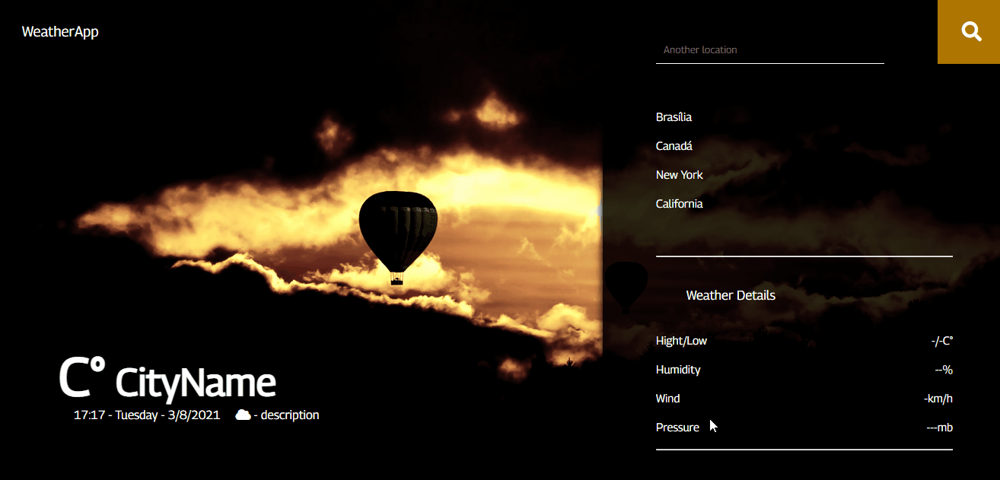

# Weather App Web

## Demo 📸

 

## Application deploy with netlify: :dash:

> https://weatherappwsl.netlify.app

## 📜 About the Project
  
WeatherApp Web is a simple weather app that uses an OpenWeatherMap API to fetch the temperature of places in the world and their weather data such as: humidity, wind, pressure and temperature. 

### 🛠 Technologies

<li><a href="https://reactjs.org">React.js</a></li>
<li><a href="https://sass-lang.com">SCSS</a></li>
<li><a href="https://www.javascript.com">JavaScript</a></li>
<li><a href="https://openweathermap.org/current">OpenWeatherMap API</a></li>
<li><a href="https://github.com/axios/axios">Axios</a></li>
<li><a href="https://developer.mozilla.org/en-US/docs/Web/API/Navigator/geolocation">Navigator</a></li>

## 💻 How to run the application

#### Pre-requisites: You must have the tools installed:  <a href="https://git-scm.com">Git</a>, <a href="https://nodejs.org/en/">Node.js</a>

<pre>
# In the terminal, clone the project:
$ git clone https://github.com/Wesley-wsl/WeatherApp.git

# Enter the project folder:
$ cd WeatherApp

# Install dependencies:
$ yarn install
ou
$ npm install

# Run the application:
$ yarn start
ou
$ npm run start
</pre>

Okay, now you can access the application from the route:  <a href="https://localhost:3000/">https://localhost:3000/</a>
